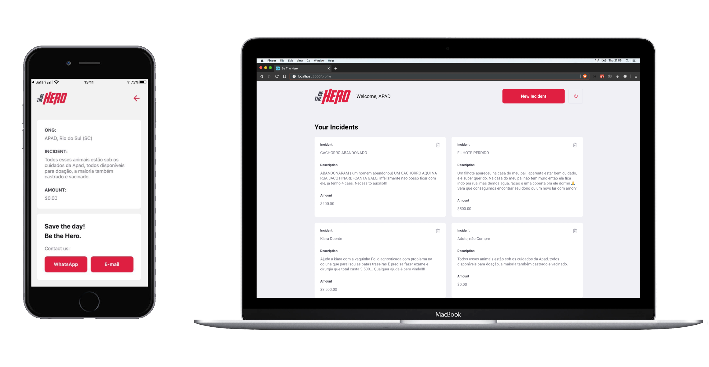

<h1 align="center">
    
</h1>

<h4 align="center">
  🚀 Semana OmniStack 11.0
</h4>

  

  

  

  

 

  

## :rocket: Tecnologias

Esse projeto foi desenvolvido com as seguintes tecnologias:

- [Node.js](https://nodejs.org/en/)
- [React](https://reactjs.org)
- [React Native](https://facebook.github.io/react-native/)
- [Expo](https://expo.io/)

## 💻 Projeto

BeTheHero é um projeto que visa conectar pessoas com capital investidor a ONGs.

## 🤝 Contributing

- Fork the repository;
- Create a branch for your edits: `git checkout -b new-feature`
- Commit changes to your own branch: `git commit -m 'feat: New feature'`
- Push the change back to your fork: `git push origin new-feature`

Submit a Pull request. We will review and merge your change.

## :memo: License

This project is licensed under the MIT license. See the [LICENSE](LICENSE) file for details.

